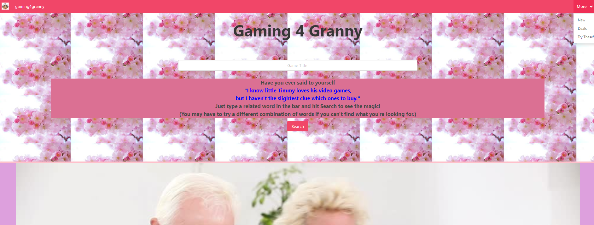

# project 1
UCI Boot Camp Project 01 - Gaming 4 Granny v1
Collaborators: Maxx Sanner, Jonathan Hui, Michael Trujillo

This was the first project for the full stack web development program at UC Irvine, in which the goal was to build an interactive application that:

-Must use at least two server-side APIs
-Must use a CSS framework other than Bootstrap
-Must be interactive (i.e: accept and respond to user input)
-Use at least one new third-party API
-Must have a polished UI
-Must meet good quality coding standards
-Does not use alerts, confirms or prompts (look into modals)
-Must be deployed to GitHub Pages

# link to deployed application:
https://maxx105.github.io/Gaming4Grannies/

# image of deployed application:

# Technologies
For this project, we used two server-side API's targeted for getting data about video games: CheapShark and RAWG. See links below:

- CheapShark API: https://apidocs.cheapshark.com/?version=latest
- RAWG API: https://api.rawg.io/docs/

For styling, we used the CSS framework, Bulma. See link below:

- https://bulma.io/

For scripting, we also used JQuery:

- https://jquery.com/

# Purpose
The intention behind this project was to build an application designed to help less tech-savvy and potentially older individuals with finding the perfect video games for themselves and/or their loved ones. With the use of our simple-to-use interface, even granny will have no trouble at all finding the perfect gift for little Timmy!

# How to use: 
In order to use this application you can type a game title into the search bar. Doing so will populate the page with game play videos, reviews, store information, and a short abstract about the game. If you’re in a hurry or you aren’t sure what you’re looking for you can click on one of our tabs that will lead you to another web page with predetermined information, such as newest releases 2020, best games of 2020, or games with the best deals!

